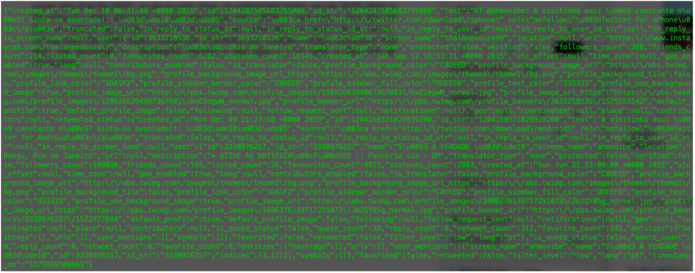
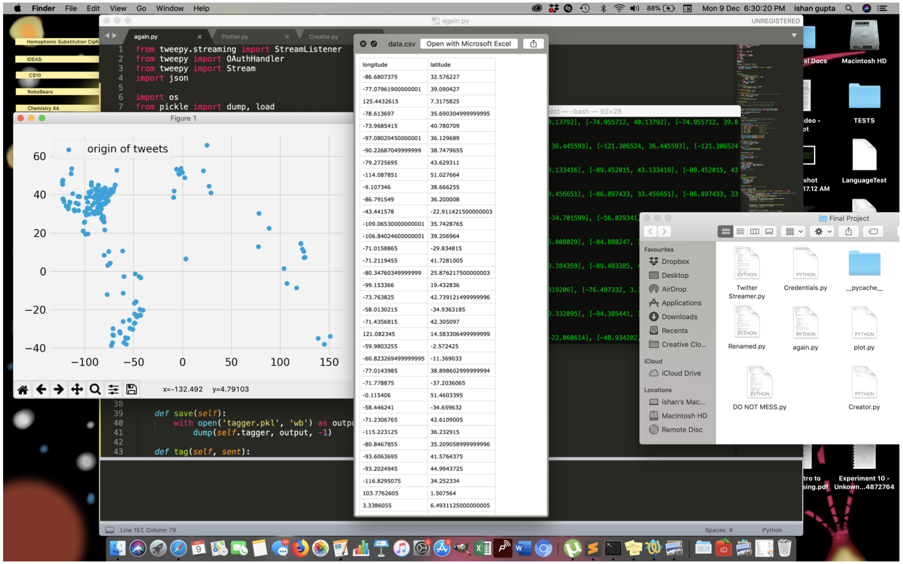
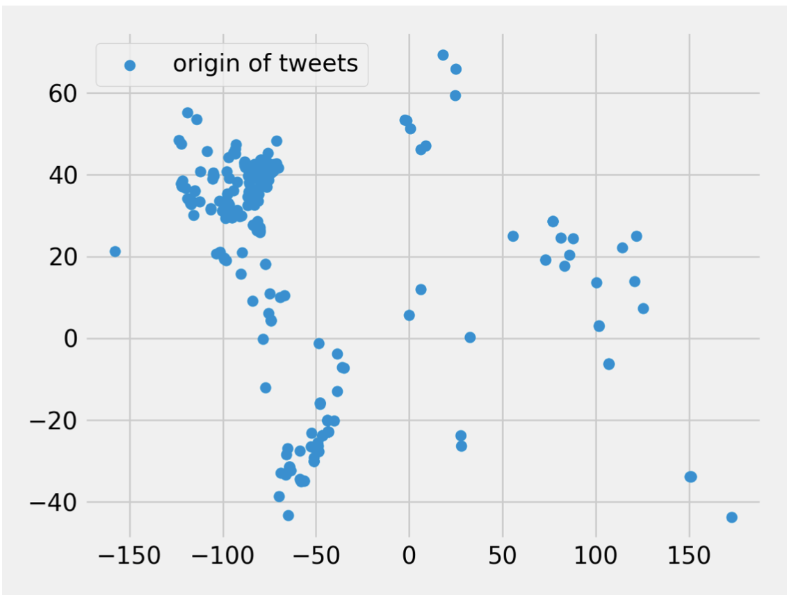

# README

### DEMO VIDEO

<iframe width="560" height="315" src="https://www.youtube.com/embed/pCvVDvYsdyk" title="YouTube video player" frameborder="0" allow="accelerometer; autoplay; clipboard-write; encrypted-media; gyroscope; picture-in-picture" allowfullscreen></iframe>

Our final project is intended to track the spread of diseases (based on the settings) using data from
Tweets. The project works on three main levels: the retrieval of live data from twitter, the
processing of the JSON object (on the basis of the tweet and its geolocation settings) and finally the
plotting of data in real time.

For the first part of the project (the retrieval of data) we first had to go through the entire process of
requesting an API from Twitter after doing which we got a ‘consumer key’, a ‘consumer secret’, an
‘access token’ and an ‘access token secret’ using with a class of StreamListener which we got from
“tweepy.Streaming”. However, initially we had been using static data, but soon realised our mistake
and had to understand how to retrieve a stream of data instead. The data we streamed came in the
form of JSON objects which brought us to the next part of the project.

Initially when we tried to
extract data from the JSON, we got an error. Soon, we realised that twitter sent the JSON object in
the form of a string and hence we converted it back into a JSON to work with it. Once this was done
we analysed big chunks of data to understand what information we needed (shown below). We also
learn that JSON objects worked like dictionaries and contained multiple dictionaries with them. Our
knowledge of dictionaries obtained in labs made it a lot easier to deal with the information.

**Shown below is an example of the JSON objects we received:**

After this, the last and probably the hardest part of the project was figuring our a way to update our
graph in real-time. For the purpose of plotting we were using MatPlotLib. And our initial goal was
to update the graph using the show() function, however, we learnt that the show() function actually
blocks the entire script from running and hence we had to think of an alternate way. After trying
everything from switching off the block (in which case the graph just didn’t show up) to trying to
import data into another script every-time new data was obtained, we finally found our solution in
creating a csv file and storing each new datum as a row in the csv file and then running a real time

grapher that read this file every certain amount of time. Finally, we obtained results that looked
something like this:

And it gave us a plot that looked like this after 20 minutes of updating.

Finally, the program ran on three scripts. The first was the credentials script which contained all the
access keys etc give to us by twitter. The second was the main script that streamed the data, used the
language processing feature, created the csv file, dealt with the JSON and finally saved the relevant
data in the csv file. The third and final was the script that plotted the updated data from the csv file.
Therefore **to run the program** all three scripts should be in the first folder firstly. And then, the

#How To Use It:

Fill up the Credentials.py file, then run app.py and Plotter.py simultaneously to get real time graphing. 
And to change the keywords that the program looks for, edit the words in the last 
list at the end of the script --> 'stream.filter(track["add words to this list"])'